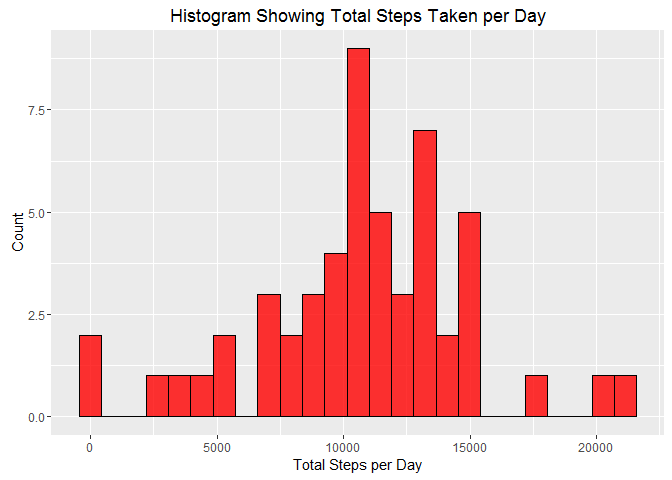
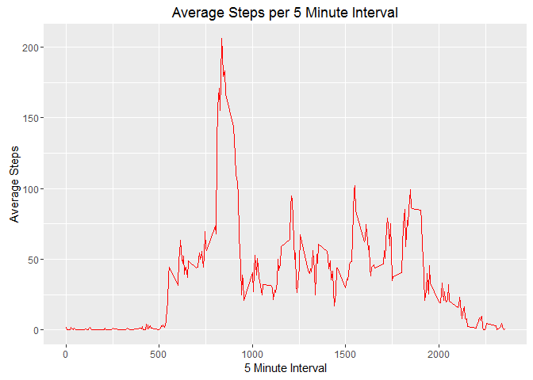
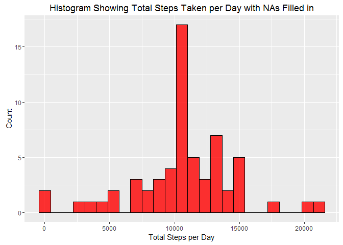
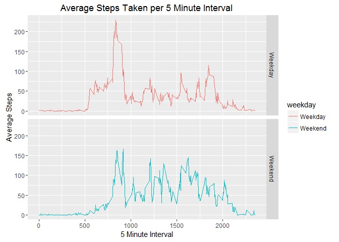

# reproducible research week 1
nathan martinez  
April 8, 2016  
*First load required packages*

```r
require(dplyr)
require(ggplot2)
```
***

###Loading and Processing the Data
Load the data and assign the data frame to object "activity"

```r
activity<-read.csv("./RepData_PeerAssessment1/RepData_PeerAssessment1/activity.csv",header=T)
```
***

###What is the mean total number of steps taken per day?
Use dplyr to get total number of steps, grouped by day, and save to object "dailySteps" to make other calculations easier

```r
dailySteps<-data.frame(activity %>% group_by(date) %>% summarise(totalSteps=sum(steps)))
```

**Construct a histogram of the total number of steps taken each day**


```r
ggplot(dailySteps,aes(x=totalSteps))+geom_histogram(na.rm=T,bins=25,fill=10,color=9,alpha=0.8)+xlab("Total Steps per Day")+ylab("Count")+ggtitle("Histogram Showing Total Steps Taken per Day")
```



**Reporting the mean and median number of steps taken each day (mean first, median second)**


```r
mean(dailySteps$totalSteps,na.rm=T)
```

```
## [1] 10766.19
```

```r
median(dailySteps$totalSteps,na.rm=T)
```

```
## [1] 10765
```
***

###What is the average daily activity pattern?
**Creating a time series plot of avg number of steps per interval**

First make new data frame with average number of steps per interval, averaged across all days

```r
intervalSteps<-data.frame(activity %>% group_by(interval) %>% summarise(avgSteps=mean(steps,na.rm=T)))
head(intervalSteps)
```

```
##   interval  avgSteps
## 1        0 1.7169811
## 2        5 0.3396226
## 3       10 0.1320755
## 4       15 0.1509434
## 5       20 0.0754717
## 6       25 2.0943396
```

Then create a time series plot showing the average steps per time interval using the newly created data frame

```r
ggplot(intervalSteps,aes(x=interval,y=avgSteps))+geom_line(color="red")+labs(x="5 Minute Interval",y="Average Steps",title="Average Steps per 5 Minute Interval")
```



Looks like, on average, this individual likes to jog/walk/exercise using their legs in the morning.

**Find the 5 minute interval with the most steps taken (on average, averaged across all days)**


```r
intervalSteps$interval[which.max(intervalSteps$avgSteps)]
```

```
## [1] 835
```
835 means that the 5 minute interval in which the most steps were taken (on average, averaged across all days) was from 08:35 to 08:40. Some morning treadmill action maybe?
***

###Imputing missing values
**Total number of rows with missing values (NAs) in the data set**

Two different ways to approach this, I'm worried people grading me won't realize how my first method works so I'll show that the two are equivalent.

First method:

```r
nrow(activity)-nrow(na.omit(activity))
```

```
## [1] 2304
```

Second method: (only searches for missing values in the steps column, not in all columns, which is why I preferred the first approach)

```r
sum(is.na(activity$steps))
```

```
## [1] 2304
```

Both give a result of 2304. There are **2304** missing values (NAs) in this data set.

**Devise a strategy for filling in the missing values**

I'll be filling in the missing values in the "steps" column with the average steps taken per interval, averaged across all days. We found these values in a previous step of this assignment and stored them in a data frame object with the name "intervalSteps". The code I will use to find the missing values and fill them in will be the following:

```r
for(i in 1:nrow(activityNew)) {
      if(is.na(activityNew$steps[i])) {
            activityNew$steps[i]<-intervalSteps$avgSteps[intervalSteps$interval==activityNew$interval[i]]
      }
}
```

**Create a new dataset with the missing values filled in**

Implementing the code described above:

```r
activityNew<-activity

for(i in 1:nrow(activityNew)) {
      if(is.na(activityNew$steps[i])) {
            activityNew$steps[i]<-intervalSteps$avgSteps[intervalSteps$interval==activityNew$interval[i]]
      }
}
```

**Make a histogram of the total number of steps taken each day**


```r
dailyStepsNew<-data.frame(activityNew %>% group_by(date) %>% summarise(totalSteps=sum(steps)))

ggplot(dailyStepsNew,aes(x=totalSteps))+geom_histogram(bins=25,fill=10,color=9,alpha=0.8)+xlab("Total Steps per Day")+ylab("Count")+ggtitle("Histogram Showing Total Steps Taken per Day with NAs Filled in")
```



**Calculate the new mean and median of the total number of steps taken per day**

Mean:

```r
mean(dailyStepsNew$totalSteps)
```

```
## [1] 10766.19
```

Median:

```r
median(dailyStepsNew$totalSteps)
```

```
## [1] 10766.19
```
Comparing these two values to the mean and median obtained earlier with the NAs removed (and not filled in), we can see that the mean has remained the same and there is only a very small difference in the median. The old mean was 10766.19, and the new mean is 10766.19. The old median was 10765, and the new median is 10766.19.

**What is the impact of imputing the missing data on the estimates of the total daily number of steps?**

To answer this question, I'll highlight a portion of the old and new versions of the "dailySteps" data frames

```r
compareDailySteps<-cbind(dailySteps,dailyStepsNew)[24:54,-3]
compareDailySteps %>% rename(totalStepsNew=totalSteps.1)
```

```
##          date totalSteps totalStepsNew
## 24 2012-10-24       8355       8355.00
## 25 2012-10-25       2492       2492.00
## 26 2012-10-26       6778       6778.00
## 27 2012-10-27      10119      10119.00
## 28 2012-10-28      11458      11458.00
## 29 2012-10-29       5018       5018.00
## 30 2012-10-30       9819       9819.00
## 31 2012-10-31      15414      15414.00
## 32 2012-11-01         NA      10766.19
## 33 2012-11-02      10600      10600.00
## 34 2012-11-03      10571      10571.00
## 35 2012-11-04         NA      10766.19
## 36 2012-11-05      10439      10439.00
## 37 2012-11-06       8334       8334.00
## 38 2012-11-07      12883      12883.00
## 39 2012-11-08       3219       3219.00
## 40 2012-11-09         NA      10766.19
## 41 2012-11-10         NA      10766.19
## 42 2012-11-11      12608      12608.00
## 43 2012-11-12      10765      10765.00
## 44 2012-11-13       7336       7336.00
## 45 2012-11-14         NA      10766.19
## 46 2012-11-15         41         41.00
## 47 2012-11-16       5441       5441.00
## 48 2012-11-17      14339      14339.00
## 49 2012-11-18      15110      15110.00
## 50 2012-11-19       8841       8841.00
## 51 2012-11-20       4472       4472.00
## 52 2012-11-21      12787      12787.00
## 53 2012-11-22      20427      20427.00
## 54 2012-11-23      21194      21194.00
```
Looking at the two columns (for the old and new versions of the data set), we can see that the days that were entirely NA in the old version (and thus resulted in a daily total number of steps of "NA") have changed to have a total number of steps of 10766.19, which also happens to be our calculated average number of steps taken per day (averaged over each day in the data set).

In regards to the days that did not have missing values, their total daily number of steps have remained unchanged.

In regards to having NAs in general, it would appear that either an entire day was NA or the day had no NAs at all. This would explain the days having NA for their total daily steps taken being changed to 10766.19 (the average total steps taken per day) and the days that already had a number for total daily steps taken not being changed at all.
***

###Are there differences in activity patterns between weekdays and weekends?
**First we create the new factor variable for weekday/weekend**

```r
activityNew2<-activityNew %>%
      mutate(weekday=ifelse(weekdays(as.Date(activityNew$date)) %in% c("Saturday","Sunday"),"Weekend","Weekday")) %>%
      mutate(weekday=factor(weekday,levels=c("Weekday","Weekend")))
```

**Now we plot avg steps per 5 minute interval averaged over all days, faceted by weekday/weekend**
First we need to calculate the average steps per 5 minute interval for weekday/weekend

```r
wkday<-activityNew2 %>%
      filter(weekday=="Weekday") %>%
      group_by(interval) %>%
      summarise(avgSteps=mean(steps),weekday="Weekday")
wkend<-activityNew2 %>%
      filter(weekday=="Weekend") %>%
      group_by(interval) %>%
      summarise(avgSteps=mean(steps),weekday="Weekend")
suppressMessages(intervalStepsNew<-full_join(wkday,wkend))
rm(wkday,wkend)
head(intervalStepsNew)
```

```
## Source: local data frame [6 x 3]
## 
##   interval   avgSteps weekday
##      (int)      (dbl)   (chr)
## 1        0 2.25115304 Weekday
## 2        5 0.44528302 Weekday
## 3       10 0.17316562 Weekday
## 4       15 0.19790356 Weekday
## 5       20 0.09895178 Weekday
## 6       25 1.59035639 Weekday
```

Now we need to make a line plot of the 5 minute interval averages faceted by weekday/weekend

```r
ggplot(intervalStepsNew,aes(x=interval,y=avgSteps,color=weekday))+geom_line()+facet_grid(weekday~.)+labs(title="Average Steps Taken per 5 Minute Interval",x="5 Minute Interval",y="Average Steps")
```



Thanks for reading!
